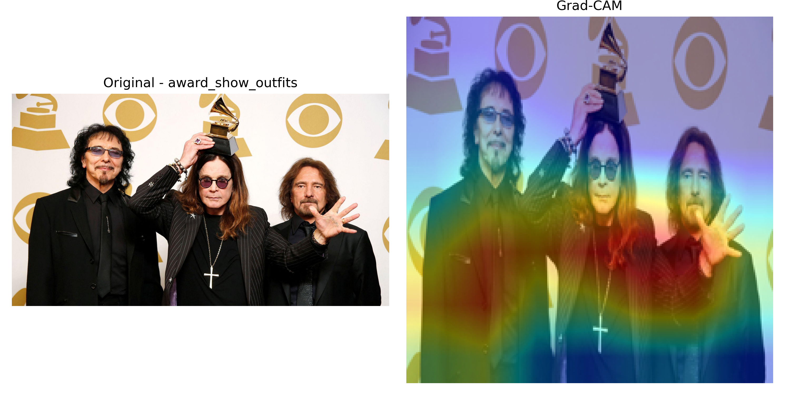

# Ozzy Fashion Classifier 🎸

A fun deep learning project to classify the legendary Ozzy Osbourne's outfits into different fashion eras.  
This project is my tribute to the Prince of Darkness, combining my love for rock and machine learning 🤘.

---

## 📂 Dataset

A custom image dataset of Ozzy Osbourne, manually grouped into the following fashion-themed classes:

- `bat_cape_era`
- `glam_metal_80s`
- `mtv_ozzy`
- `modern_ozzy`
- `award_show_outfits`

Each image is organized into its corresponding folder and used for supervised image classification.

---

## 🧠 Model Overview

- ✅ Architecture: **ResNet18** (pretrained on ImageNet)
- 🔁 Transfer learning applied
- 🔄 Augmentations: flip, brightness, resize
- 🔍 Explainability via **Grad-CAM**
- 📦 Framework: **PyTorch**

---

## 🖼️ Sample Prediction

> Grad-CAM output showing focus on Ozzy's iconic outfit.



---

## 🛠️ How to Run

```bash
# Train the model
python train.py

# Predict an image
python predict.py --img "data/modern_ozzy/000012.jpg"

# Visualize model attention
python gradcam_visual.py
```

---

## 📦 Requirements

Install dependencies:

```bash
pip install -r requirements.txt
```

---

## 🤘 Tribute

> “You can't kill rock and roll. It's here to stay.”  
> — Ozzy Osbourne

---

## 🧪 Status

✅ MVP Completed  
🚀 Planning to try EfficientNet and Grad-CAM++  
🎯 Might deploy via Streamlit for demo

---

## 📫 Contact

**Md. Shahrul Zakaria**  
GitHub: [bringerofdarkness](https://github.com/bringerofdarkness)